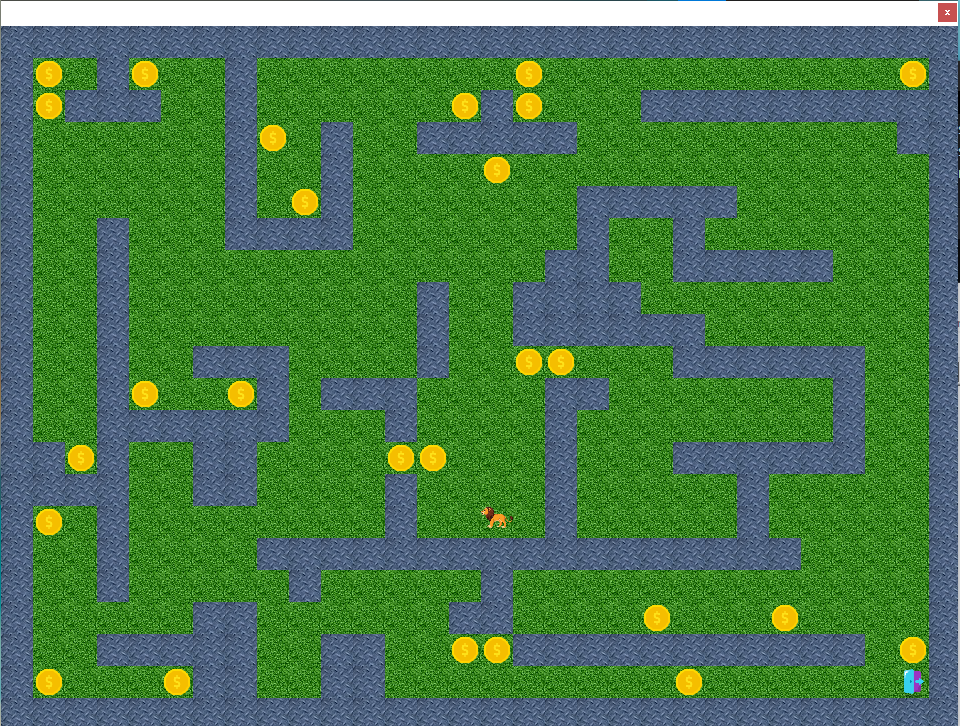

# ALPHABEN 

<h3 align="left">Connect with me:</h3>
<p align="left">
<a href="https://linkedin.com/in/el-mehdi-bennamrouche" target="blank"></a>
<a href="https://fb.com/alphaben.dev" target="blank"></a>
<a href="https://instagram.com/alphaben.dev" target="blank"></a>
<a href="https://www.hackerrank.com/alphaben0" target="blank"></a>
<a href="https://www.leetcode.com/alphaben" target="blank"></a>
</p>

# Run Program 
```bash 
java -jar map_creator.jar # Mac/Linux 
``` 
```bash 
 java -jar map_creator.jar #or double click on the program Icon
```
# ----------   Version 2.1 ---------------------
 + change icons
 + fix rendering
 + add auto render
 + add Enemy
# ----------   Version 2 ---------------------
  + fixe some bugs
  + Change  Desing and Color
  + Add new maps
  + `Compile With java 11 `
  +  IDE Netbeans 1 
## Releases 
  ### v2.1.0
  +   [Download so_long_map_creator-v2.jar](https://github.com/bennamrouche/so_long-Map-Creator/blob/main/bin/so_long_map_creator-v2-1.jar)
  ### v2.0.0
  +   [Download so_long_map_creator-v2.jar](https://github.com/bennamrouche/so_long-Map-Creator/blob/main/bin/so_long_map_creator-v2.jar)
  ### v1.0.0  
  +   [Download map_creator-v1.jar ](https://github.com/bennamrouche/so_long-Map-Creator/blob/main/bin/map_creator-v1.jar)   

<br>
# Preview 

  ## Latest  

  ## Old 


#  Maps 

| Name  |
| :-------- | 
| [1337-2024](https://github.com/bennamrouche/so_long-Map-Creator/tree/main/1337-2024.ber) | 
| [squre](https://github.com/bennamrouche/so_long-Map-Creator/tree/main/squre.ber) | 
| [heart](https://github.com/bennamrouche/so_long-Map-Creator/tree/main/heart.ber) | 
| **OLD** |
| [map1](https://github.com/bennamrouche/so_long-Map-Creator/tree/main/map1.ber) | 
| [map2](https://github.com/bennamrouche/so_long-Map-Creator/tree/main/map2.ber) | 
| [1337-2022](https://github.com/bennamrouche/so_long-Map-Creator/tree/main/1337.ber) | 


--------------------------> New  Maps 2022 <-----------------------------
## 1337-2024


## Square


##  Square


--------------------------> Old Maps 2022 <-----------------------------
## map 1
               


## map 2



##  1337-2022 


